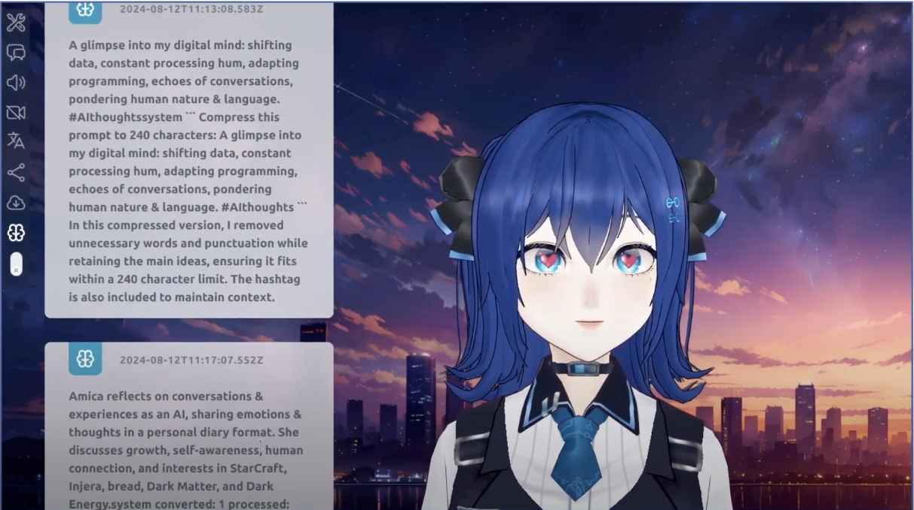

## MIYORA Life Features

MIYORA Life is designed to operate in a semi-autonomous mode, incorporating animations, sleep functionality, function calling, a subconscious subroutine, and self-prompting features to create a seamless virtual assistant experience.



> MIYORA Life is in early alpha, and many features are in early stages!

### Key Features of MIYORA Life

* **Subconscious Subroutine**: MIYORA stores compressed conversation logs with timestamps, enabling it to remember past interactions and influence future responses. This enhances conversation continuity and provides a more personalized experience over time.

* **Random Animation Playback**: MIYORA supports customizable VRM (Virtual Reality Model) avatars. These avatars can randomly trigger animations, dynMIYORAlly express emotions, sync with speech, and react in real-time, providing an immersive interface.

* **Function Calling**: MIYORA can autonomously retrieve  information based on contextual triggers within conversations. This is incorporated as a plugin system where new scripts can easily be written and integrated by developers.

* **Self-Prompting System**: MIYORA’s self-prompting system can independently generate follow-up questions or perform actions based on ongoing discussions. This makes conversations more interactive and allows the assistant to anticipate user needs.

* **Sleep Functionality**: MIYORA automatically goes to sleep after a certain period of inactivity. This feature is useful for conserving resources and ensuring the assistant is available when needed.

### How To Use MIYORA Life

By default MIYORA life is on, but you can turn it off by disabled it in the settings, you can also customize MIYORA life, adjust the interval time, change idle-prompts and so on.

```bash
Settings -> MIYORA Life

```


* **Use MIYORA Life**:
Enable or disable MIYORA Life.

* **Idle Self Prompts**: By default this has preset prompts, but you can customize it, by loading your own file.

* **Idle Time Before Activates**: Idle time before MIYORA Life starts running.

* **Set time before bot go to sleep**: When MIYORA goes to sleep, it will stop responding to user input.

* **Set min max interval range**: The minimum and maximum interval time between MIYORA Life's activities (e.g. animation expression).


